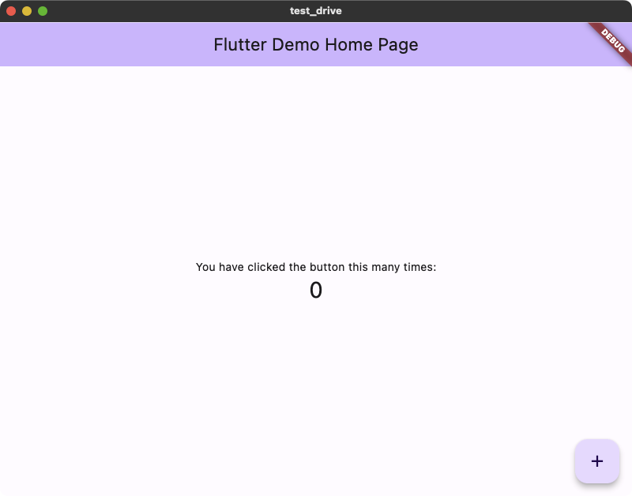
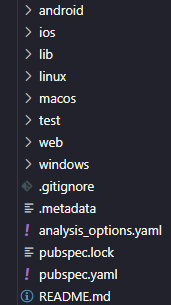

# Iniciando um App Flutter

=== "Visual Studio Code"

    !!! info "Observação" 
        Este exemplo utiliza o **Visual Studio Code** como IDE,  mas se quiser também pode utilizar o Android Studio (basta ter memória RAM suficiente).

    ## Configurando o Visual Studio Code

    1. Com o Visual Studio Code aberto, no menu lateral, selecione a aba "extensões".

    2. No campo de busca, digite "Flutter". O primeiro resultado da busca será o plugin oficial. Clique no pequeno botão "Install" na cor verde. O plugin já contém tudo que precisamos para executar e debugar nosso código Dart.

    

    !!! success "Tudo Pronto" 
        Finalmente podemos criar nosso primeiro aplicativo em Flutter!

    ## Iniciando um App Flutter

    1. No terminal do Windows, navegue até o diretório onde deseja iniciar o seu projeto e execute o seguinte comando:   
    ``` { .powershell .copy }
      flutter create meu_primeiro_app
    ```
    
    2. O Flutter ficará encarregado de criar todos os arquivos da aplicação. Feito isso, ainda no terminal, navegue até o diretório que foi criado pelo CLI: 
    ``` { .powershell .copy }
      cd meu_primeiro_app
    ```

    3. Para abrir o projeto no Visual Studio Code basta executar o comando:
    ``` { .powershell .copy }
      code .
    ```

=== "Terminal"

    1. Para iniciar um novo aplicativo em Flutter, execute o seguinte comando:
    ``` { .powershell .copy }
      flutter create meu_primeiro_app
    ```

    2. Navegue para o diretório criado:
    ``` { .powershell .copy }
      cd meu_primeiro_app
    ```

    3. Verifique se você possuí um dispositivo de destino (emulador) em execução:
    ``` { .powershell .copy }
      flutter devices
    ```
        - Caso não tenha, abra o Android Studio, configure e inicie um novo emulador.

    4. Por fim, para iniciar seu aplicativo, execute o seguinte comando:
    ``` { .powershell .copy }
      flutter run
    ```

## Resultados

Se tudo ocorreu bem, você terá um aplicativo inicial semelhante a esse:

{ width=500 }

E uma estrutura de diretórios assim:



!!! tip "Dica"
    A maior parte dos arquivos do seu aplicativo se encontram no diretório `lib` e provavelmente é la que você passará a maior parte do tempo.
