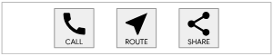
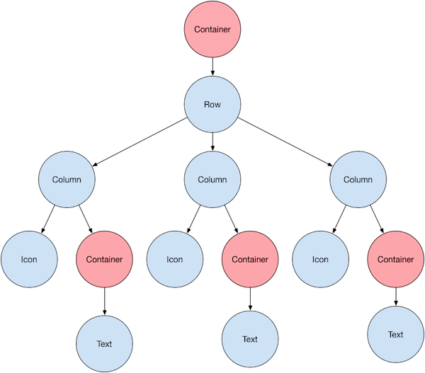

# Widgets

## Introdução aos Widgets

Em Flutter, criamos interfaces usando **widgets**. Os widgets do Flutter são criados usando uma estrutura moderna que se inspira no React. A ideia central é que você crie sua interface do usuário a partir de widgets. Os widgets descrevem como deve ser a visualização de acordo com a configuração e o estado atuais. Quando o estado de um widget é alterado, o widget reconstrói sua descrição, que a estrutura diferencia em relação à descrição anterior para determinar as alterações mínimas necessárias na árvore de renderização subjacente para fazer a transição de um estado para o próximo.

No Flutter, quase tudo é um widget, até mesmo os modelos de layout são widgets. As imagens, ícones e texto que você vê em um aplicativo Flutter são todos widgets. Mas as coisas que você não vê também são widgets, como as linhas, colunas e grades que organizam, restringem e alinham os widgets visíveis.

Veja um exemplo de um componente simples, com três botões:

<figure markdown="span">
  
</figure>

Essa é a representação da sua estrutura de widgets:

<figure markdown="span">
  
</figure>

## Widgets Básicos

**Text**: O widget `Text` no Flutter é utilizado para exibir texto na interface do usuário. Ele é um dos widgets mais básicos e essenciais, sendo amplamente utilizado em quase todos os aplicativos para mostrar informações textuais. Exemplo:
``` {.dart .copy}
Text(
  'Este é um exemplo de texto',
  style: TextStyle(
    fontSize: 18,
    fontWeight: FontWeight.bold,
    color: Colors.blue,
  ),
  textAlign: TextAlign.center,
  overflow: TextOverflow.ellipsis,
  maxLines: 2,
)
```

**Row e Column**: Os widgets `Row` e `Column` são usados para organizar outros widgets em layouts horizontais e verticais, respectivamente. Eles são fundamentais para a construção de interfaces de usuário flexíveis e responsivas.

  - **Row**: O widget `Row` organiza seus filhos em uma linha horizontal. Isso é útil para criar layouts onde os elementos devem ser dispostos lado a lado. Exemplo:
  ``` {.dart .copy }
  Row(
    mainAxisAlignment: MainAxisAlignment.spaceAround,
    children: [
      Icon(Icons.star),
      Text('Row Example'),
      Icon(Icons.favorite),
    ],
  )
  ```

  - **Column**: O widget `Column` organiza seus filhos em uma coluna vertical. É útil para criar layouts onde os elementos devem ser dispostos um embaixo do outro. Exemplo:
  ``` {.dart .copy }
  Column(
    mainAxisAlignment: MainAxisAlignment.center,
    crossAxisAlignment: CrossAxisAlignment.start,
    children: [
      Text('Primeiro item'),
      Text('Segundo item'),
      Text('Terceiro item'),
    ],
  )
  ```

**Stack**: O widget `Stack` no Flutter é usado para sobrepor widgets uns sobre os outros. Ao contrário dos widgets `Row` e `Column`, que organizam seus filhos em linhas e colunas, o `Stack` permite que os widgets sejam posicionados em camadas, o que é útil para criar interfaces complexas onde elementos precisam se sobrepor, como em layouts com imagens de fundo, botões flutuantes, ou textos sobrepostos. Exemplo:
``` { .dart .copy }
Stack(
  children: [
    // Widget de fundo
    Container(
      width: 200,
      height: 200,
      color: Colors.blue,
    ),
    // Texto centralizado
    Positioned(
      left: 50,
      top: 50,
      child: Text(
        'Texto sobreposto',
        style: TextStyle(color: Colors.white, fontSize: 18),
      ),
    ),
    // Ícone no canto inferior direito
    Positioned(
      right: 10,
      bottom: 10,
      child: Icon(
        Icons.star,
        color: Colors.yellow,
        size: 30,
      ),
    ),
  ],
)
```

**Container**: O widget `Container` é um dos widgets mais versáteis e usados no Flutter. Ele funciona como um "caixa" que pode ser configurada para ter bordas, margens, preenchimento, cores, tamanhos, e até transformações. Ele é frequentemente usado como um bloco de construção básico para definir e controlar o layout e o estilo de outros widgets na interface. Exemplo:
``` { .dart .copy }
Container(
  padding: EdgeInsets.all(20),
  margin: EdgeInsets.symmetric(vertical: 10),
  decoration: BoxDecoration(
    color: Colors.blue,
    borderRadius: BorderRadius.circular(10),
    boxShadow: [
      BoxShadow(
        color: Colors.black26,
        blurRadius: 5,
        offset: Offset(2, 2),
      ),
    ],
  ),
  width: 200,
  height: 100,
  child: Center(
    child: Text(
      'Exemplo de Container',
      style: TextStyle(color: Colors.white, fontSize: 16),
    ),
  ),
)
```

## StatelessWidget

O `StatelessWidget` é um dos tipos básicos de widgets no Flutter, e como o nome sugere, ele é um widget "sem estado". Isso significa que, uma vez que ele é criado, não é possível mudar seu estado, ou seja, seus valores internos não mudam durante a execução do aplicativo.

### Caracteristicas do StatelessWidget

**Uso Simples**: Ideal para widgets que apenas exibem informações ou têm um comportamento fixo. Por exemplo, textos, ícones, botões simples, ou qualquer coisa que não precise responder a mudanças de estado.

**Reuso de Código**: Como os StatelessWidgets são simples e imutáveis, eles podem ser facilmente reutilizados em diferentes partes do aplicativo, garantindo consistência e facilidade de manutenção.

### Exemplo de uso de um StatelessWidget

``` { .dart .copy }
import 'package:flutter/material.dart';

class MyApp extends StatelessWidget {
  @override
  Widget build(BuildContext context) {
    return MaterialApp(
      home: Scaffold(
        appBar: AppBar(
          title: Text('Exemplo StatelessWidget'),
        ),
        body: Center(
          child: MeuWidget(),
        ),
      ),
    );
  }
}

class MeuWidget extends StatelessWidget {
  @override
  Widget build(BuildContext context) {
    return Text(
      'Olá, Flutter!',
      style: TextStyle(fontSize: 24, color: Colors.blue),
    );
  }
}

void main() {
  runApp(const MyApp());
}
```

## StatefullWidget

O `StatefulWidget` é outro tipo fundamental de widget no Flutter, projetado para criar interfaces dinâmicas e interativas. Ao contrário do `StatelessWidget`, que é imutável, o `StatefulWidget` pode mudar de estado ao longo do tempo, permitindo que a interface responda a interações do usuário, mudanças nos dados, ou qualquer outra situação que exija uma atualização visual.

### Estrutura do StatefulWidget

Um StatefulWidget é composto por duas classes principais:

1. **StatefullWidget**: A classe que define o widget em si. Esta classe é imutável, ou seja, uma vez criada, ela não pode mudar. Ela cria uma instância de uma classe `State`, onde o estado mutável do widget é gerenciado.

2. **State< T >**: A classe onde o estado do widget é mantido e gerenciado. Ela é responsável por construir o widget (ou conjunto de widgets) com base no estado atual. Essa classe implementa o método `build`, que é chamado sempre que o estado muda para reconstruir a interface do usuário.

### Exemplo de uso de um StatefullWidget

``` { .dart .copy}
import 'package:flutter/material.dart';

class ContadorWidget extends StatefulWidget {
  @override
  _ContadorWidgetState createState() => _ContadorWidgetState();
}

class _ContadorWidgetState extends State<ContadorWidget> {
  int _contador = 0;

  void _incrementarContador() {
    setState(() {
      _contador++;
    });
  }

  @override
  Widget build(BuildContext context) {
    return Column(
      mainAxisAlignment: MainAxisAlignment.center,
      children: <Widget>[
        Text(
          'Você pressionou o botão tantas vezes:',
        ),
        Text(
          '$_contador',
          style: Theme.of(context).textTheme.headline4,
        ),
        ElevatedButton(
          onPressed: _incrementarContador,
          child: Text('Incrementar'),
        ),
      ],
    );
  }
}

class MyApp extends StatelessWidget {
  @override
  Widget build(BuildContext context) {
    return MaterialApp(
      home: Scaffold(
        appBar: AppBar(
          title: Text('Exemplo StatefulWidget'),
        ),
        body: Center(
          child: ContadorWidget(),
        ),
      ),
    );
  }
}

void main() {
  runApp(const MyApp());
}
```